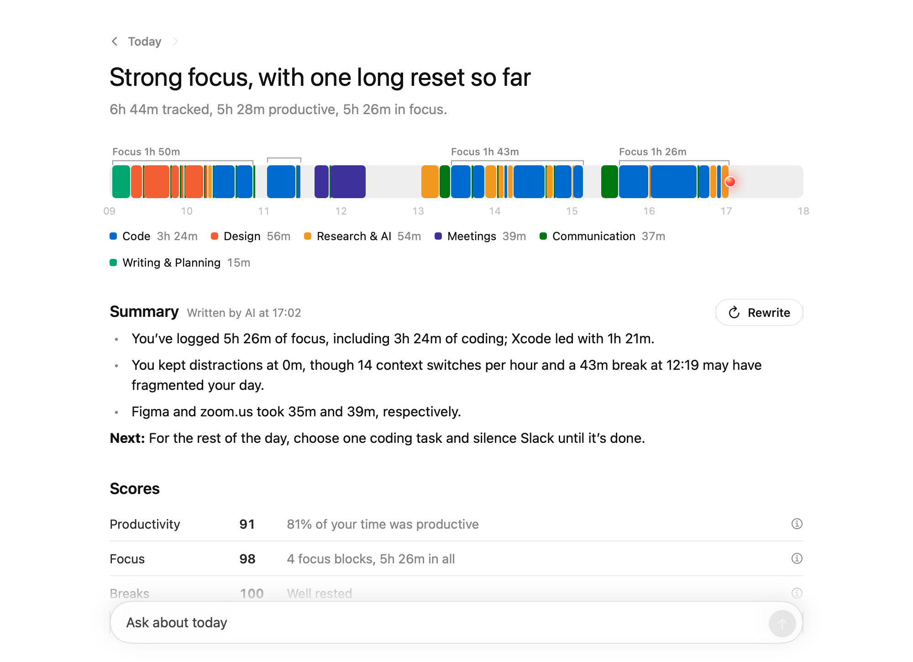

# Ribbon

The AI time tracker for Mac. Ribbon tracks the apps and websites you use, shows how you spent your day, and blocks distractions while you work.

**Website:** https://ribbon-lake.vercel.app



## What it does

- **Tracks your time automatically.** Every app and website you use, and for how long, with idle and lock-screen detection. Everything is stored on your Mac.
- **Sorts your time into categories.** AI puts each app and website into a category (OpenAI's Decisions API). Add your own categories by describing what belongs in them.
- **Shows your day.** A daily ribbon of your activity, focus blocks, breaks, Productivity / Focus / Break scores, and daily and weekly reviews written by AI.
- **Blocks distractions while you focus.** Session types decide which apps and websites you can use. Anything else is hidden or quit, and blocked tabs turn into a "blocked" page. An optional orb watches your screens and nudges you out loud when you drift.
- **Answers questions about your time.** Ask things like "How long was I on YouTube this week?" and get answers from your own log.

## Download

Get the latest notarized build: **[Ribbon.dmg](https://github.com/lenajeremy/ribbon/releases/latest/download/Ribbon.dmg)**. Open it, drag Ribbon to Applications, and add your OpenAI API key in Settings › AI.

Ribbon keeps itself up to date. It checks this repository's releases every few hours, shows you what's new, and installs the new version when it restarts. Updates are installed only if they're signed by the same developer. To turn this off, go to Settings › General. See what changed in each version in [CHANGELOG.md](CHANGELOG.md).

## Build from source

### Requirements

- macOS 14 or later, Apple silicon or Intel
- Xcode with Swift 6 (command line tools are enough to build)
- An OpenAI API key (models: `gpt-6-luna` for sorting, reviews and answers; `gpt-4o-mini-tts` for the orb's voice)

### Build and run

```sh
git clone https://github.com/lenajeremy/ribbon.git
cd ribbon
cp .env.example .env      # then put your OpenAI API key in .env
./build.sh                # builds, installs to /Applications/Ribbon.app and launches it
```

Ribbon lives in the menu bar. Open the dashboard from there, or open Ribbon again from Spotlight.

`build.sh` signs with your Developer ID or Apple Development certificate if you have one, so macOS remembers the permissions below across rebuilds; otherwise it signs ad hoc.

### Release a new version

1. Raise `RIBBON_VERSION` and `RIBBON_BUILD` in `scripts/make_bundle.sh`, and add a section for the version to `CHANGELOG.md`.
2. Run `scripts/release.sh` to build a universal app, sign it with your Developer ID and notarize it. It makes `dist/Ribbon.dmg` for the website and `dist/Ribbon.zip` for the updater.
3. Run `scripts/publish.sh` to create the GitHub release with both files, using the version's changelog section as its notes. Copies of Ribbon find it within a few hours.

## Permissions

| Permission | What it's for |
|---|---|
| Screen Recording | Reading window titles, and the orb's screen checks during focus sessions |
| Automation (per browser) | Reading the current tab's address in Chrome, Safari, Arc, Brave and Edge, and redirecting blocked sites |
| Accessibility | Hiding apps a focus session doesn't allow (without it, they're quit) |
| Notifications | Break reminders and "session done" alerts |

## Privacy

Your timeline, sessions, chats and settings are stored on your Mac in `~/Library/Application Support/Ribbon`. The AI sees app names, website names, page titles and totals. Screenshots are only taken during focus sessions that watch your screen, are sent to OpenAI to judge whether you're on task, and are never saved.

## Project layout

```
Sources/Ribbon/
  App/         launch, settings, menu bar
  Tracking/    activity tracker, browser access, break reminders
  AI/          OpenAI client, categorizer, reviews and answers
  Data/        local database, categories, scores
  Focus/       focus sessions, blocking, the orb
  Dashboard/   the dashboard window
Resources/AppIcon.icon   the app icon (Icon Composer); redraw it with `swift scripts/make_icon.swift`
docs/                    the website
```

## License

MIT
